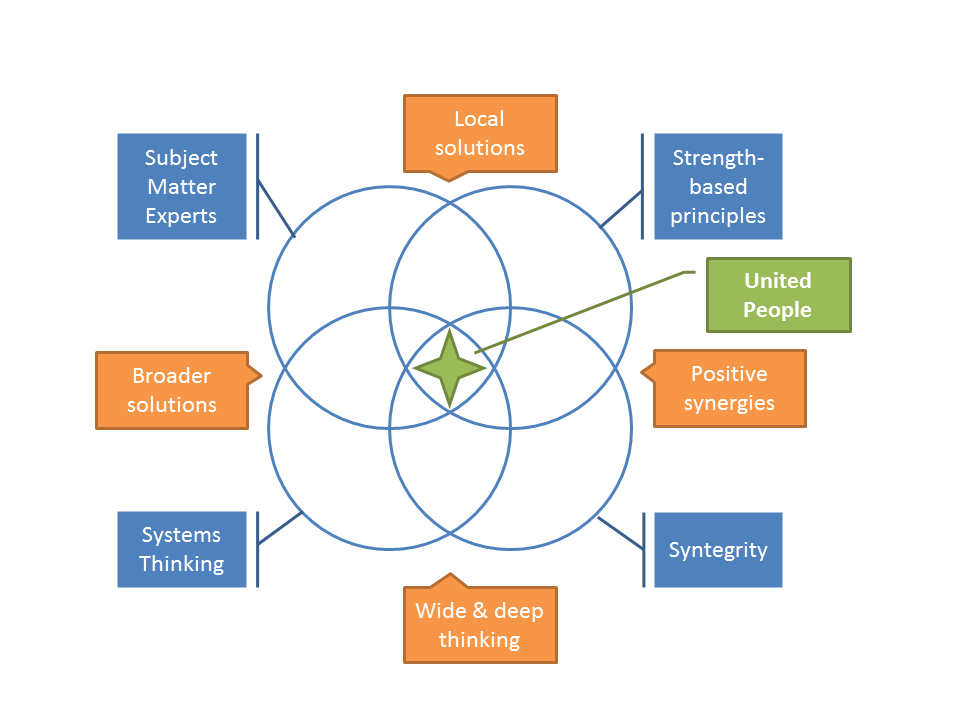

# Why do we propose this? 

A lot of successful problem solving initiatives are already going on in the world, some experimenting, some already validated, well and alive. These initiatives mostly solve specific problems by involving people from the field, which makes us label them "*P2P initiatives*".

Yet as good as these initiatives might be, most of them are disconnected one from another, thereby losing the potential of eliciting further emergence from co-creation.

This is all the most disappointing as these successful initiatives wouldn’t be what they are if not already for the power of networking between peers and, well, emergence and co-creation. So there is no reason why the magic that gave birth to them couldn't happen again in another place (promotion of initiatives), with another problematic situation (transdisciplinarity) or at another level (scaling up).

Yet emergence seems to stop at some kind of frontier, some [Dunbar](https://en.wikipedia.org/wiki/Dunbar%27s_number)-like number which limits the impact and participation to the solution to a small team at best.

On another aspect, P2P is currently used by the most “on the edge” people, the ones with an entrepreneur mindset. But what about the rest of the world? How to attract them? From a “[change adoption curve](https://en.wikipedia.org/wiki/Diffusion_of_innovations)” it seems we need to “attract” new “customers”. But what if we built a P2P system that might turn any person into an Early Adopter because the system can bring him/her exactly what’s she’s looking for? That would turn everybody into an Innovator and make "change resistance" basically irrelevant.

It's time to really **Think Global and Act Local** or, as [Edgar Morin](https://en.wikipedia.org/wiki/Edgar_Morin) puts it: "**Combine the global with the local**".

Where [netarchical companies](http://p2pfoundation.net/Netarchical_Capitalism) flourished on people's needs for meaning in their lives by sharing with others, we need to build a society where the [sharing economy](http://p2pfoundation.net/Sharing_Economy) would truly benefits its participants.

## What we propose 
What we propose is precisely to build an organization based on the principles or P2P networks and inspired by existing P2P initiatives whose overall purpose would precisely to devise a roadmap toward creating a sustainable AND abundance-based P2P society.

That organization will need to:
* list the societal topics to be addressed from a P2P perspective and between them, in the most systemic way ever devised (the systems thniking methods to do this exist since tens of years, the time's more than ripe to put use them);
* analyze the current systemic conditions of society and its transformation into a more P2P-practising society (that it become a P2P-only society or that P2P coexists with capitalism will have to be decided by the syntegration although Michel Bauwens envisions a coexistence of the two, including a persistence of existing governments in a similar  form)
* how to grow such a P2P society from the world as it is at the time of starting the syntegration, to the state defined at the previous point (100% P2P society or only partially P2P society)
* how to make that P2P society as encompassing as possible by respecting a few conditions:
  1. be **free** to anybody on planet Earth without consideration of any sort of criteria;
  2. be **fair** in recognizing the equivalence of all humans;
  2. be **sustainable** (ie, not assume an infinite world);
  3. be **abundance-based** (ie assume everybody has something worth to contribute to the world, whatever his/her possibilities).

## What should the organization look like?

Here's a diagram showing the components at play in how we see it functioning.

These components are the following:
* Subject Matter experts to bring knowledge in the fields where solutions are sought by people in need throughout the world;
* Strength-based principles to change to help liberate the forces of participants or customers of the organization: what is wanted, how to get it, and what already works;
* Systems Thinking to 