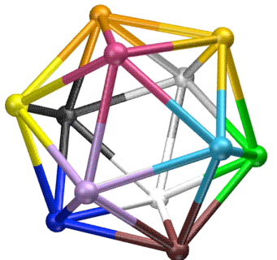

# How to do it? 

## Pre-requisites

Here are the pre-requisite knowledge that we think is necessary to successfully contribute to this initiative. Not everybody needs to be knowledgeable in all of them of course, neither be an expert.
* Ross Ashby's **Law of Requisite Variety** or in more layman terms: the ones closest to an issue know the most about it;
* Stafford Beer's **Viable System Model**: systemic principles that may help in creating organizations that can remain viable on the long term;
* Stafford Beer's **Team Syntegrity** to facilitate cross-topic exchange and pollination;
* **Strength-based approaches to change** like Appreciative Inquiry, Solution Focus and Positive deviance. These approaches to change are based on the principles that whatever you're looking for, you're going to find it or create it along the way. So we might as well go for the positive and the solutions right from the beginning;
* **Peer-to-Peer initiatives** in the most diverse possible topics in order to build an organization as representative of the diversity of humanity as possible;
* **Facilitation techniques** in order to elicit that collective intelligence we're looking after.

## Global roadmap
We propose to use the team syntegrity systemic method to allow field matter and p2p experts to interact together in the most efficient way in order to design a roadmap to allow for a full blown transition from the current world to a more if not full p2p mankind.

The road ahead might seem impossible to tackle. And indeed it will be a complex and tough work to reclaim. Yet, there are proofs that the P2P paradigm works:

* long before the term even existed, humans interacted, exchanged and co-created together. Probably more so in the past than nowadays
* current P2P initiatives do function, even if they’re still rooted in some capitalistic way of thinking.

## A roadmap for a global syntegration would look like the following:

1. Gathering interesting people to contribute to the improvement of this paper
2. Finalizing the list of the 12 topics or so to be addressed by the syntegration
3. Publicize the initiative and gather participation
4. Organize the work groups (in the original syntegration, there are 20 of them each participating in 2 topics and criticizing 2 others) around the 12 topics.
5. Finalize the roadmaps for all the topics and publish them
6. Turn the roadmaps into action as defined in them — ie, launch the initiative, the transformation of the world
7. Build the permanent United Peers structure to support the global movement

## What’s the vision? 
Our guiding vision is one where circles of people self-organize locally to tackle locally relevant issues, on the list of topics as defined above. Circles might be tied to geographically specific issues, and/or more topic related issues.

All bottom circles connect to an upper circle to coordinate actions with other similar circles in the broader geographic area and/or topic. and so forth up to a global level, somehow like the United Nations, only it would be more like “United Peers”.

How these circles exchange information might be in physical presence or through Internet use (collaborative platforms, video conferencing tools, decision making web sites, etc.) and is left to the circles to determine themselves.

# How to run the organization

The basic premise to run such a big (global) and wide (all humanity's centers of interest) organization would need two specific Systems Thinking "inventions" to function:
* be inspired by the **Viable System Model** from Stafford Beer
* foster systemicity in the exchanges of its members through the use of **Team Syntegrity** (also a Stafford Beer legacy)

## Contributions of the Viable System Model (VSM)

The VSM is a model which can serve two purposes:
* design an organization so as to ask the good questions which answers will help make it viable on the long term
* audit an existing organizaion so as to ensure its viability is assured.

##Contributions of Team Syntegrity (TS)

TS would help in organizing the exchanges in the different fields of expertise represented in the organization in the most efficient possible way. It allows for:
* exchange between all topics;
* in the most resource (cost) effective way

The list of topics to be included is limited in the traditional way of conducting TS (12 at most), though experiences have been successful in running with either few or more topics).

### List of topics to be included
This list would ideally be of 12 topics. Should we end with a different number (as ideally required by Team Syntegrity), another scheme could be devised.

Current list, in alphabetical order:
1. Agriculture (food), 
2. Arts, 
3. Commons, 
4. Economy (currencies), 
5. Education, 
6. Environment (resources: non-renewable and others)
7. Governance (politics),
8. Health, 
9. Medias,
10. Spirituality, 
11. Technology (energy, manufacturing...), 
12. Transport
